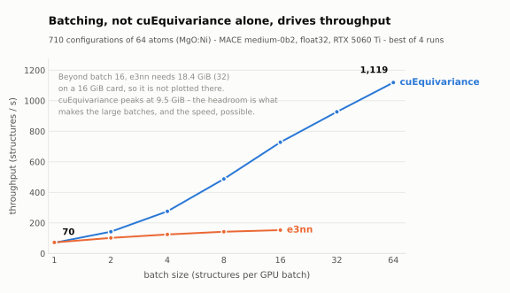
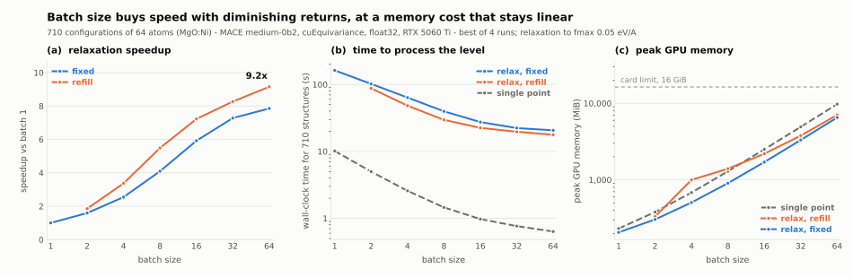

.. _mace-mlip:

Machine-learning potentials (sod_mace)
======================================

``sod_mace.py`` evaluates `MACE <https://github.com/ACEsuit/mace>`_
machine-learning-potential energies over the configurations of a level, and
optionally relaxes them at fixed cell.  It is the MLIP counterpart of the
``sod_*_ener.sh`` energy collectors: it walks the ``cYY/`` directories and
writes ``nXX/ENERGIES`` in the same two-column format, so ``sod_stat.sh``
consumes the result unchanged.

Like those collectors it performs **no** statistical mechanics and does not read
``ENSEMBLE`` — degeneracies play no part in computing an energy.  Feed the
resulting ``ENERGIES`` to ``sod_stat.sh`` for the thermodynamics.

Structures are evaluated in GPU batches rather than one at a time, which is
where nearly all the speed comes from: on 64-atom configurations, batching is
worth 16x on single-point energies and 7.9x on relaxation — 9.2x with
``-batchmode refill`` — compared with running the same code one structure at a
time.  See `Performance`_ for the
measurements and the conditions they were taken under.

Installation
------------

Unlike the rest of SOD this tool is **not** built by ``make``; it needs a Python
environment with PyTorch, ASE, ``mace-torch`` and the NVIDIA ALCHEMI toolkit.
Nothing else in SOD depends on it, and the regression suite skips its test when
the stack is absent.

In brief — full instructions and the validated version list are in
:doc:`installation` and ``pysod/README.md``:

.. code-block:: bash

   conda create -n nvalchemi python=3.12
   conda activate nvalchemi
   pip install torch --index-url https://download.pytorch.org/whl/cu130
   pip install nvalchemi-toolkit ase mace-torch
   pip install cuequivariance-torch cuequivariance-ops-torch-cu13   # optional

Usage
-----

.. code-block:: bash

   sod_mace.sh [nXX] [options]

As with the other post-processing tools, run it from the main problem directory
to process every ``nXX/`` in sequence, or from a single ``nXX/`` to process that
composition only.

Because the Python stack lives in its own environment, tell the wrapper which
interpreter to use by setting ``SOD_PYTHON`` once in your ``~/.bashrc``:

.. code-block:: bash

   export SOD_PYTHON=~/miniconda3/envs/nvalchemi/bin/python

No ``conda activate`` is needed.  If ``SOD_PYTHON`` is unset the wrapper falls
back to ``python3``, and if the stack is not importable it reports that
explicitly rather than failing with a traceback.

Settings file
-------------

Rather than passing options on the command line every time, put them in a
``mace_settings.yaml`` file.  A copy in ``nXX/`` takes priority over one in the
main problem directory, following the same rule as ``INSQS``; options given on
the command line override the file.

.. code-block:: yaml

   model: medium-0b2        # MACE foundation model name
   device: cuda             # cuda | cpu
   batch: 16                # maximum structures per GPU batch

   relax: true              # fixed-cell FIRE2 relaxation (false = single point)
   batchmode: refill        # fixed | refill  (batch scheduling, relax only)
   fmax: 0.05               # force convergence, eV/A
   maxsteps: 200            # maximum relaxation steps

The keys are the option names below without the leading dash.  Unknown keys,
wrong types and invalid choices are reported with the file and key named, so a
typo fails loudly instead of being ignored.  ``examples/example01/FILER0_mace``
ships a fully commented example.

.. note::

   In YAML 1.1 a bare ``on``, ``off``, ``yes`` or ``no`` is a boolean, so
   ``cueq: off`` arrives as ``false``.  That case is handled, but quoting
   (``cueq: "off"``) removes the ambiguity.

Options
~~~~~~~

``-model <name>``  (default ``medium-0b2``)
  MACE foundation model, downloaded and cached on first use.

``-checkpoint <path>``
  Local torch-serialised MACE model instead of a foundation model.

``-device cuda|cpu``  (default ``cuda``)

``-batch <N>``  (default ``16``)
  Maximum structures per batch.  Larger is faster over the whole range measured
  — see `Performance`_ — so 16 is a **memory-safe default rather than an
  optimum**: it peaks at about 2.5 GiB for a 64-atom cell, which leaves room on
  an 8 GiB card, where 32 would not.  Raise it if the card allows.  The best
  value depends on structure size, neighbour density, model, GPU and whether
  forces are requested, so treat it as a tuning knob, not a constant.

``-relax``
  Fixed-cell FIRE2 relaxation of atomic positions.  The cell and PBC are held
  fixed.

``-relaxcell``
  Relax the cell as well as the positions, driven by the MACE stress.  Requires
  ``-relax``; see `Variable-cell relaxation`_ below.

``-writerelaxed yes|no``  (default ``yes``)
  Whether to write the relaxed geometry into each ``cYY/``.  Requires
  ``-relax``; see `Very large levels`_ below.

``-pressure 
``  (default ``0``)
  Target external pressure in GPa for ``-relaxcell``.

``-lattice cub|tet|ort|hex|rho|mon|tri``
  Lattice system.  Also writes ``nXX/CELL`` with the columns that system implies,
  matching ``sod_vasp_cell.sh``.  Requires ``-relaxcell``.

``-batchmode fixed|refill``  (default ``fixed``)
  How structures are scheduled into batches during relaxation; see
  `Batch scheduling during relaxation`_ below.  Only meaningful with ``-relax``.

``-fmax <F>``  (default ``0.05``)
  Force convergence threshold in eV/Å.

``-maxsteps <N>``  (default ``200``)

``-structure <name>``
  Structure file to read in each ``cYY/``.  By default this follows the INSOD
  ``FILER`` value: ``0`` reads ``configuration.cif``, ``11`` reads ``POSCAR``.

``-cueq on|off|auto``  (default ``auto``)
  cuEquivariance acceleration, used when available.

``-force``
  Overwrite existing MACE result files (see below).

``-q``
  Suppress progress output.

Variable-cell relaxation
------------------------

By default only the atomic positions move and the cell stays at whatever
``sod_comb.sh`` generated from ``INSOD``.  That is usually the wrong constraint:
substitution changes the equilibrium volume, so the fixed cell leaves every
configuration strained.  In ``example01`` MACE reports **+3.66 GPa** on the
generated cell (a = 8.44 Å) — it wants to expand, and the committed VASP results
agree, having relaxed to a ≈ 8.50 Å.

``-relaxcell`` relaxes positions and cell together with ``FIRE2VariableCell``,
using the stress MACE computes by strain autograd:

.. code-block:: bash

   sod_mace.sh -relax -relaxcell -lattice cub

Convergence requires **both** the maximum atomic force and the maximum force on
the cell to fall below ``-fmax``, both in eV/Å.  The cell force comes from the
same stress conversion the optimizer itself uses, so the two criteria are
consistent; this mirrors how ASE's ``UnitCellFilter`` folds cell gradients into a
single ``fmax`` array.  A consequence worth knowing is that the residual
pressure at convergence is roughly ``fmax / a²`` — about 0.1 GPa for
``-fmax 0.05`` on an 8.5 Å cell.  Tighten ``-fmax`` if you need better.

A target pressure is set with ``-pressure`` in GPa, which relaxes the enthalpy
H = E + P V rather than the energy:

.. code-block:: bash

   sod_mace.sh -relax -relaxcell -pressure 5

``ENERGIES`` always contains the final internal energy ``E`` in eV, matching the
convention used by the VASP and GULP extraction scripts.  For a nonzero target
pressure, MACE also writes ``ENTHALPIES`` with ``H = E + P V`` in eV, which is
the quantity to use for constant-pressure configurational weights.
``MACE_RELAXATION.dat`` retains the final internal energy and volume used to
compute the ``P V`` contribution.  At zero pressure no ``ENTHALPIES`` file is
written; a stale one from an earlier pressure run is removed only when
``-force`` is used.

Variable-cell runs are more expensive than fixed-cell ones.  MACE must compute
stress as well as energy and forces, they commonly take considerably more
optimization steps (order 100 rather than order 10), and SOD rebuilds the
neighbour list after every cell update.  The last cost is required for
correctness: a cache invalidated from atomic displacements alone can miss new
periodic neighbours that enter the model cutoff as the cell changes, even when
the Cartesian atomic positions barely move.  ``MACE_RELAXATION.dat`` gains
``initial_volume_A3``, ``final_volume_A3``, ``final_cellforce_eV_A`` and
``final_pressure_GPa`` columns.

.. note::

   Each configuration then relaxes to *its own* cell, so the ensemble no longer
   shares one lattice.  That is physically correct at constant pressure, and is
   exactly what the ``CELL`` file and its ensemble averaging exist for — but it
   does mean the relaxed structures are no longer a common-supercell set.

The CELL file
~~~~~~~~~~~~~

With ``-lattice`` the relaxed cells are written to ``nXX/CELL`` in the same
format as ``sod_vasp_cell.sh`` and ``sod_gulp_cell.sh``: one row per
configuration, in ``cYY`` order, with no index column, and the columns implied
by the lattice system.

===========  ===========================
system       columns
===========  ===========================
``cub``      ``a V``
``tet``      ``a c V``
``ort``      ``a b c V``
``hex``      ``a c V``
``rho``      ``a alpha V``
``mon``      ``a b c beta V``
``tri``      ``a b c alpha beta gamma V``
===========  ===========================

As in the shell extractors, the first parameter is back-derived from the volume
(cubic ``a`` is ``V**(1/3)``), so it is the volume-equivalent lattice parameter.
The implementation is checked against the committed
``example01/FILER11_vasp/n04/CELL``, which ``sod_vasp_cell.sh cub`` produced from
the DFT CONTCARs: it reproduces all 71 rows exactly.

Because the rows are positional, ``CELL`` is only written when results cover
every configuration ``1..N`` in the level's ``ENSEMBLE``.  This is a general
SOD policy shared with ``sod_vasp_cell.sh`` and ``sod_gulp_cell.sh``.  Sparse
results, including a CPME calibration subset, may still produce a valid indexed
``ENERGIES`` file, but cannot produce an unambiguous ``CELL``; the tool warns
and skips it.

Batch scheduling during relaxation
----------------------------------

``-batchmode`` controls only how structures are packed into GPU batches; the
relaxation itself is fixed-cell FIRE2 to the same ``-fmax`` in both cases.

Configurations converge at different rates, so a batch that started full ends
each chunk nearly empty — wasted GPU work.

``fixed``
  Relax independent chunks of ``-batch`` structures.  Converged structures are
  dropped from the batch and the chunk finishes with whatever remains.  Simple,
  with no set-up pass.

``refill``
  Keep the batch full by admitting queued structures into the slots freed by
  converged ones, using ALCHEMI's ``SizeAwareSampler`` and
  ``FIRE2.refill_check``.  Every structure's initial energy and forces are
  computed once up front in batches, so an incoming structure already has the
  forces ``FIRE2`` needs and no extra model evaluation is required.  This
  up-front cache is what makes refill pay: a refill that evaluates newcomers
  eagerly measured *slower* than fixed chunks, and is deliberately not offered.

The two modes are numerically equivalent.  On the 71-configuration example they
give identical step counts for every configuration and final energies agreeing
to 2.4e-4 eV, the float32 reproducibility limit; the regression suite checks
that parity.  ``refill`` is the faster choice for levels with many
configurations, and its advantage grows with the number of structures relative
to the batch size.  ``fixed`` remains the default because it is simpler and
skips the initial cache pass.

.. note::

   Under ``refill`` a batch slot is reused by different configurations over
   time, so identity is carried explicitly by a ``source_index`` property rather
   than by position in the batch.

Output
------

``nXX/ENERGIES`` — two-column ``m  E`` in eV, with a comment line recording the
model and backend:

.. code-block:: text

   # MACE medium-0b2, cuEq, float32, single-point
   1  -372.6918334961
   2  -372.7885131836

.. warning::

   Existing MACE result files are **not** overwritten unless ``-force`` is
   given.  This includes ``ENERGIES``, ``ENTHALPIES``,
   ``MACE_RELAXATION.dat``, ``CELL`` when requested, and
   ``cYY/relaxed.cif`` or ``cYY/relaxed_POSCAR``.  Unlike the
   ``sod_*_ener.sh`` collectors, which regenerate their output from calculator
   files still on disk, replacing DFT or previous MLIP results may not be
   recoverable.

   A rerun narrower than the one before it is refused for the same reason: the
   level summaries ``ENTHALPIES``, ``MACE_RELAXATION.dat`` and ``CELL`` pair
   with the ``ENERGIES`` of the run that wrote them, so one left behind by a
   wider run would be read as belonging to this one.  ``-force`` removes them.
   Relaxed structures are never removed this way -- they are inputs for later
   work rather than a summary of one run.

With ``-relax``, each configuration additionally gets ``cYY/relaxed.cif`` (or
``relaxed_POSCAR`` for VASP input) alongside its input file, and the level gets
a summary table:

.. code-block:: text

   # configuration initial_energy_eV final_energy_eV relaxation_energy_eV steps final_fmax_eV_A converged
        1    -372.6917114258    -372.7014160156      -0.0097045898     6     0.042379 1

``ENERGIES`` then holds the relaxed energies.  Input structure files are never
modified, so a second run cannot silently relax an already-relaxed geometry.

Very large levels
-----------------

One ``relaxed.cif`` per configuration is the right default when a level holds
thousands of configurations, and the wrong one when it holds millions.  Each
64-atom structure is about 6.3 kB, but on a 4 kiB-block filesystem it occupies
8 kiB, and the ``cYY/`` directory and input structure cost another 8 kiB, so a
level of 10\ :sup:`6` configurations takes roughly **16 GiB** and 3 million
inodes for 9.7 GB of data.  Traversing, archiving or transferring that tree
afterwards costs minutes each time, and an inode quota -- common on shared HPC
filesystems -- can refuse the run outright.

``-writerelaxed no`` keeps ``ENERGIES``, ``MACE_RELAXATION.dat``, and
``ENTHALPIES``/``CELL`` when requested, but writes no per-configuration
structure:

.. code-block:: bash

   sod_mace.sh -relax -writerelaxed no

The relaxation itself is unchanged -- same trajectories, same step counts, same
energies -- so this is a storage decision, not a physics one.  It is **not**
much of a speed decision either: writing the structures costs about 4 minutes
per 10\ :sup:`6` configurations, against roughly 7 hours of fixed-cell
relaxation or 50 hours of variable-cell relaxation for the same count on an
RTX 5060 Ti, i.e. about 1 % and 0.1 % of the run.  What it saves is disk,
inodes, and every later operation over the tree.

When only a few relaxed geometries are actually wanted -- to look at local
distortions around a substitution, say -- the usual pattern is to run the large
level with ``-writerelaxed no``, pick the configurations of interest from
``ENERGIES``, and re-relax just those in a smaller level with the default
``-writerelaxed yes``.

.. note::

   ``-writerelaxed no`` does not remove ``relaxed.cif`` files an earlier run
   left behind, and does not check for them -- the run writes no structure, so
   there is nothing to protect from being overwritten.  Clear them yourself
   before rerunning a level that was previously relaxed with structures
   written, or they will sit beside an ``ENERGIES`` they no longer match.

Example
-------

``example01/FILER0_mace`` is the Ni/Mg-in-MgO rocksalt problem of ``example01``
written with ``FILER = 0``, so each of the 71 configurations carries a
``configuration.cif`` that ASE can read directly:

.. code-block:: bash

   cd examples/example01/FILER0_mace/n04
   sod_mace.sh -batch 16
   sod_mace.sh -relax -force

Performance
-----------

The numbers below were measured with this code on the physical system of
``example01/FILER0_mace/n04`` — 64-atom MgO:Ni configurations — with MACE
``medium-0b2`` in float32 on an **NVIDIA GeForce RTX 5060 Ti (16 GiB)**.  Model
loading is excluded, each measurement is preceded by a warm-up over the same
batch shape, and the value reported is the best of four runs after discarding
the first.  The script and the raw JSON are in ``benchmarks/``, so the whole
section can be regenerated.  Treat them as indicative of the *shape* of the
scaling, not as absolute constants: they depend on the model, the structure
size, the GPU and the requested outputs.

.. note::

   Every number in this section uses a **710-configuration** workload — the level's 71
   configurations, each written out ten times as an independent structure, so
   710 separate files are parsed, batched and relaxed.  The 71-configuration
   level turned out to be too short to measure batch scheduling reliably: a
   whole relaxation takes about two seconds, so the one-off cost of the
   ``refill`` cache pass is a large fraction of it, and run-to-run scatter on
   such short runs reached 20 %.  At 710 the scatter is 0.3–1.4 %.  Every point
   reports exactly ten times the 71-configuration step count (6620 fixed-cell,
   57 790 variable-cell) and 710/710 converged, which is what shows the copies
   really are relaxing independently.

         e3nn backends. cuEquivariance rises from 70 to 1119 structures per
         second between batch 1 and batch 64; e3nn rises only from 72 to 153
         over batch 1 to 16 and cannot go further on a 16 GiB card.
   :width: 100%

   Batching is what buys the speed.  The two backends are within 3 % of each
   other at batch 1; the difference at batch 16 is 4.8x, and it comes mostly
   from cuEquivariance leaving enough memory free to batch at all.

Single-point energies
~~~~~~~~~~~~~~~~~~~~~

.. list-table::
   :header-rows: 1
   :widths: 10 21 21 24 24

   * - batch
     - cuEq (struct/s)
     - e3nn (struct/s)
     - cuEq peak (MiB)
     - e3nn peak (MiB)
   * - 1
     - 70.0
     - 72.0
     - 231
     - 697
   * - 2
     - 142.5
     - 101.8
     - 380
     - 1 287
   * - 4
     - 275.7
     - 124.4
     - 682
     - 2 455
   * - 8
     - 487.6
     - 142.1
     - 1 292
     - 4 794
   * - 16
     - 728.2
     - 152.8
     - 2 504
     - 9 493
   * - 32
     - 927.2
     - *spills*
     - 4 916
     - 18 872
   * - 64
     - **1 119.1**
     - *spills*
     - 9 748
     - 24 860

Going from one structure at a time to 64 in a batch is a **16x** speedup.
Note the first row: at batch 1 cuEquivariance is marginally *slower* than plain
e3nn.  What it actually buys here is memory — at batch 32 e3nn asks for 18.4 GiB
and at 64 for 24.3 GiB, well past this card, while cuEquivariance peaks at
9.5 GiB.  The headroom is what makes the large batches, and therefore the speed,
possible at all.

.. note::

   Those two e3nn allocations exceed the card's 16 GiB, which is possible only
   because this machine runs under WSL2, where the driver spills to host memory
   instead of failing.  Throughput collapses by roughly nineteen-fold when that
   happens (8.1 structures/s at batch 32, against 152.8 at batch 16), so those
   timings measure paging rather than compute and are excluded from the plot.
   No throughput is quoted at batch 64 at all: only its peak memory was probed,
   on a 64-structure subset, since peak memory depends on how many structures
   are in flight rather than on the level size.  Without the WSL2 fallback
   expect an out-of-memory error instead.

   The cuEquivariance memory column is close to linear in the batch size, at
   roughly 152 MiB per 64-atom structure from batch 4 upwards.  The batch-71
   entry above is the exception, and it is an artefact of that run rather than a
   real saving: with 71 configurations a batch of 71 is a single chunk with no
   partial chunk after it.  The 710-configuration sweep, where every batch size
   processes many full chunks, gives 9748 MiB at batch 64 — 152 MiB per
   structure, exactly on the trend.

Relaxation
~~~~~~~~~~

         rising to 7.9x for fixed batches and 9.2x for refill. (b) wall-clock
         time for 710 structures, falling from 162 s to 21 s for relaxation and
         from 10 s to 0.6 s for single point. (c) peak GPU memory, rising
         linearly from about 200 MiB to 9.7 GiB, all well under the 16 GiB card
         limit.
   :width: 100%

   Batch size buys speed with diminishing returns, at a memory cost that stays
   linear.  Each doubling is worth about 1.6x up to batch 8, then 1.45x, 1.23x
   and 1.08x.

Fixed-cell relaxation of 710 configurations to ``fmax = 0.05`` (6620 optimizer
steps in total, 710/710 converged in every case):

.. list-table::
   :header-rows: 1
   :widths: 8 17 17 17 17 16

   * - batch
     - ``fixed`` (s)
     - ``fixed`` speedup
     - ``refill`` (s)
     - ``refill`` speedup
     - refill gain
   * - 1
     - 162.40
     - 1.00x
     -
     -
     -
   * - 2
     - 102.02
     - 1.59x
     - 87.57
     - 1.85x
     - 1.16x
   * - 4
     - 63.76
     - 2.55x
     - 48.19
     - 3.37x
     - 1.32x
   * - 8
     - 39.66
     - 4.09x
     - 29.60
     - 5.49x
     - **1.34x**
   * - 16
     - 27.43
     - 5.92x
     - 22.48
     - 7.23x
     - 1.22x
   * - 32
     - 22.31
     - 7.28x
     - 19.63
     - 8.27x
     - 1.14x
   * - 64
     - 20.68
     - 7.85x
     - 17.74
     - **9.15x**
     - 1.17x

Both speedup columns share one reference, batch 1 at 162.40 s, which has no
batch mode of its own: with a single structure in flight there is nothing to
refill.

``-batchmode refill`` is worth 1.14x–1.34x at equal batch size, most around
batch 8, where fixed chunks spend the largest fraction of their time partly
empty while the up-front cache pass has become negligible against the total.
The gain narrows at larger batches simply because fewer chunks are processed,
so there is less draining to recover.

Variable-cell relaxation of the same 710 configurations is far more expensive —
57 790 optimizer steps against 6620 — at 135.1 s (fixed batches) and 127.5 s
(refill) for batch 16.

Accuracy
--------

Energies are computed in float32.  Batched results agree with serial ASE/MACE,
and with batch size 1, to a few times :math:`10^{-4}` eV — the expected float32
reproducibility limit, and far below any physically meaningful energy
difference.  Absolute energies are only comparable within one model: different
MACE models place the zero differently.

Variable-cell results were checked against ASE ``FrechetCellFilter`` +
``MACECalculator`` + ``FIRE`` on the same configurations: relaxed volumes agree
to 0.03-0.09 %, at both zero pressure and 5 GPa.  On ``example01`` at zero
pressure MACE gives a ≈ 8.507 Å against the committed VASP value of
a ≈ 8.501 Å — agreement to about 0.006 Å, which is a useful indication of how
this MLIP performs for this system.  ``-batchmode refill`` reproduces
``fixed`` under a variable cell as well, to :math:`3\times10^{-3}` Å :sup:`3`
in volume out of ~615.
